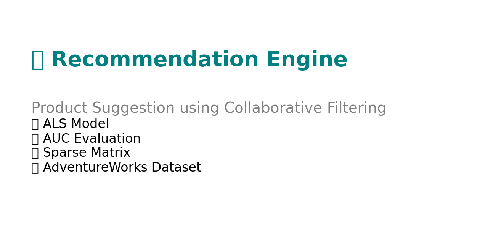

# 🛒 Recommendation Engine

This project leverages collaborative filtering on the AdventureWorks dataset to generate personalized product recommendations.

## 📌 Features
- ALS Matrix Factorization with Confidence Matrix
- Sparse Matrix generation with Scipy
- AUC-based model evaluation
- SQL Server integration via `pyodbc`
- Visualizations using Matplotlib

## 📊 Output
- 📈 Recommendation Results
- 🎯 Top Purchased Products Visualization

## 📁 Project Structure
```
notebooks/
    Recommendation_Engine.ipynb
docs/
    Recommendation_Engine.html
images/
    top_purchased_products.png
    recommendation_engine_summary_card.png
```


